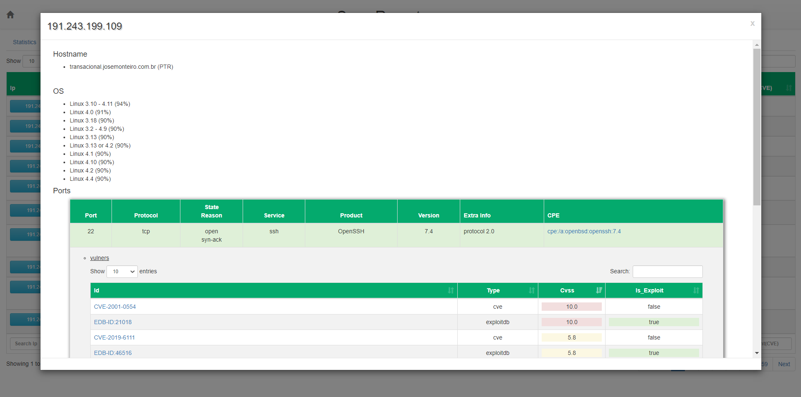

# Nmap Report Template

Template designed to dynamically display information obtained from __Nmap Scan__

## Screenshots





## Usage

1. Download the `nmap_template_report.xsl` file and, when running __Nmap__, pass the file as a `stylesheet`.

> - Example
> ```ruby
> nmap --open -A -T4 -F --script vulners -oX scanoutput.xml --stylesheet nmap_template_report.xsl 192.168.0.1-254
> ```

2. Genarete the report `html` using the tool `xsltptoc`.

> - Example
> ```ruby
> xsltproc scanoutput.xml nmap_template_report.xsl -o Report.html 
> ```


